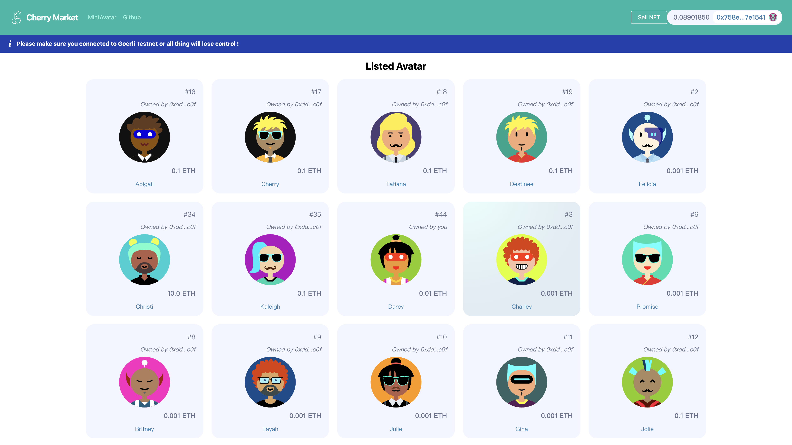

# Cherry Market Interface

<br/>
<p align="center">

</a>
</p>
<br/>

## 1. Git clone the contracts repo

## 2. Deploy to goerli 


## 3. Deploy your subgraph


## 4. Start your UI

Make sure that:
- In your `networkMapping.json` you have an entry for `NftMarketplace` on the goerli network. 
- You have a `NEXT_PUBLIC_SUBGRAPH_URL` in your `.env` file. 
```
yarn dev
```

